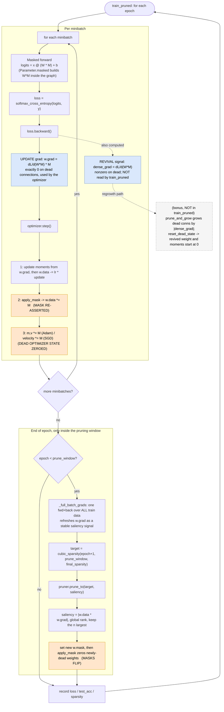

# AQUA — The Self-Pruning Network

A small neural-network library written from scratch in pure Python + NumPy, used
to train a classifier that prunes its own connections during training — and
honest evidence that the pruned model is actually cheaper.

No deep-learning frameworks are used in the core: the autodiff engine, backward
pass, optimizer, pruning, and training loop are all hand-written. **scikit-learn
appears only to load a standard dataset — never for models, training, or
gradients.**

## Layout

| Directory | What lives here |
|-----------|-----------------|
| `engine/` | Reverse-mode autodiff: the tensor type, ops, `backward()`. |
| `nn/`     | Layers, the MLP, and the optimizers (SGD + Adam). |
| `prune/`  | Masking, importance criteria, and the pruning schedule. |
| `train/`  | Dataset loading (data only), training loop, and the sweeps. |
| `tests/`  | Gradient checks and the masked-weight correctness test. |
| `utils/`  | Reproducibility helpers. |

## The self-pruning loop

How `train_pruned` actually runs: the masked forward `x @ (W*M)`, the two distinct
gradients (the update grad that is zero on dead connections vs the would-be-dense
revival signal), and exactly where masks flip and dead optimizer state is zeroed.



## Install

```bash
uv sync          # preferred
# or
pip install -r requirements.txt
```

## Run

```bash
uv run pytest                              # the whole test suite
uv run pytest tests/test_gradcheck.py      # gradient-check every op vs finite differences
uv run pytest tests/test_masked_weight.py  # masked-weight correctness (pruned weights stay zero)
uv run python -m engine.gradcheck          # per-op finite-difference report
uv run python -m train.train_mlp           # train the MLP, save the learning curve
uv run python -m train.prune_run           # self-prune to a target sparsity
uv run python -m train.pareto_run          # multi-seed sparsity sweep + Pareto plot
```

Every run fixes its seeds, so the committed numbers in `results/` reproduce from a
clean clone.

## Dataset

sklearn's `load_digits` — 1,797 8×8 handwritten digits, 10 classes. Small and real:
it trains in seconds, so a multi-seed sparsity sweep is cheap to reproduce, yet the
~9.5k-weight MLP is large enough that 90% pruning is meaningful. sklearn hands over
the raw arrays only; the shuffle, split, and standardization are NumPy.

## Results

Digits, 64-128-10 MLP, mean ± std test accuracy over 5 seeds (`results/part4_pareto.json`):

| target sparsity | saliency | magnitude |
|----------------:|:--------:|:---------:|
| 0%  | 0.972 ± 0.009 | 0.972 ± 0.009 |
| 50% | 0.977 ± 0.006 | 0.973 ± 0.009 |
| 75% | 0.978 ± 0.005 | 0.972 ± 0.005 |
| 90% | 0.973 ± 0.002 | 0.976 ± 0.004 |
| 95% | 0.962 ± 0.007 | 0.972 ± 0.005 |

**Falsifiable claim.** Saliency (|w·∂L/∂w|) pruning beats magnitude pruning at
moderate sparsity (50–75%, ≈ +0.5 accuracy points) but the two **cross over**:
at 95% sparsity magnitude wins by 0.95 points (paired over 5 seeds; standard error
0.29 points, so the gap is over 2 standard errors and not noise). So the
gradient-based criterion helps until the budget gets tight, where the magnitude
baseline is the stronger choice on this task. Re-running `train.pareto_run`
reproduces these numbers exactly.

The cost is genuine, not dense-times-zero: at 90% sparsity the model keeps 947 of
9,472 weights and the weight matmuls do 10× fewer multiply-adds — `active_params`,
`total_params`, and `mac_reduction` committed in `results/part3_pruning.json` — with a
sparse-aware forward (`train/cost.py`) that matches the dense output. This is a
FLOP / active-parameter reduction, **not** a wall-clock speedup at this scale: a NumPy
scatter over live connections does fewer operations but does not beat optimized dense
BLAS — realizing latency gains needs structured sparsity or a real sparse kernel (see
DESIGN §4).
